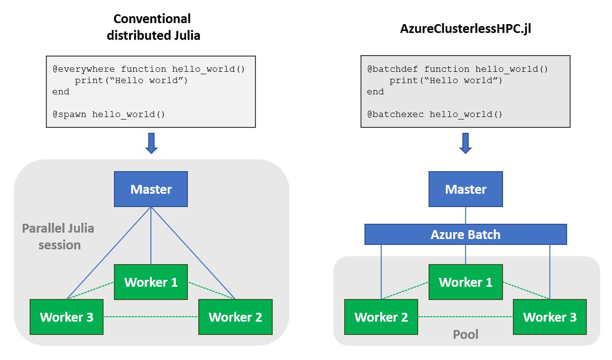

[](https://microsoft.github.io/AzureClusterlessHPC.jl/) 
[](https://github.com/microsoft/AzureClusterlessHPC.jl/actions/workflows/runtests.yml)

# AzureClusterlessHPC.jl - Simplified distributed computing

## Overview

**AzureClusterlessHPC.jl** is a package for simplified parallal computing on Azure. AzureClusterlessHPC.jl borrows the syntax of [Julia's Distributed Programming](https://docs.julialang.org/en/v1/stdlib/Distributed/) package to easily execute parallel Julia workloads in the cloud using [Azure Batch](https://azure.microsoft.com/en-us/services/batch/). Instead of a parallel Julia session, users create one or multiple worker pools and remotely execute code on them.




AzureClusterlessHPC provides macros that let us define functions on batch workers, similar to how `@everywhere` works for a parallel Julia session:

```
# Define a function
@batchdef hello_world(name)
    print("Hello $name")
    return "Goodbye"
end
```

We can then either execute this function on our local machine or as a batch job using the `@batchexec` macro (which is similar to Julia's `@spawn` macro for parallel Julia sessions):

```
# Execute function on local machine
out = hello_world("Bob")

# Execute function via Azure Batch
out = @batchexec hello_world("Jane")
```

Using the `pmap` function in combination with `@batchexec` allows us to run a multi-task batch job:

```
# Execute a multi-task batch job
out = @batchexec pmap(name -> hello_world(name), ["Bob", "Jane"])
```

## Installation

To install AzureClusterlessHPC.jl, run the following command from an interactive Julia session (press the `]` key and then type the command):

```
] dev https://github.com/microsoft/AzureClusterlessHPC.jl
```

Before being able to use `AzureClusterlessHPC.jl` you need to create a few Azure resources. Follow the instructions [here](https://microsoft.github.io/AzureClusterlessHPC.jl/installation/).

## Documentation

Follow this [link](https://microsoft.github.io/AzureClusterlessHPC.jl/) to the documentation.


## Applications

AzureClusterlessHPC can be used to bring various distributed computing applications in Julia to Azure. Check out the notebooks in the [examples](https://github.com/microsoft/AzureClusterlessHPC.jl/tree/main/examples) section to find tutorials for the following applications:

- Generic batch, map-reduce and iterative map-reduce examples

- Deep learning with AzureClusterlessHPC.jl and [Flux.jl](https://github.com/FluxML)

- Seismic imaging and inversion with [COFII.jl](https://github.com/ChevronETC/Examples) and [JUDI.jl](https://github.com/slimgroup/JUDI.jl)


## Credits

AzureClusterlessHPC.jl is developed and maintained by the [Microsoft Research for Industries](https://www.microsoft.com/en-us/research/group/research-for-industry/) (RFI) team. 
